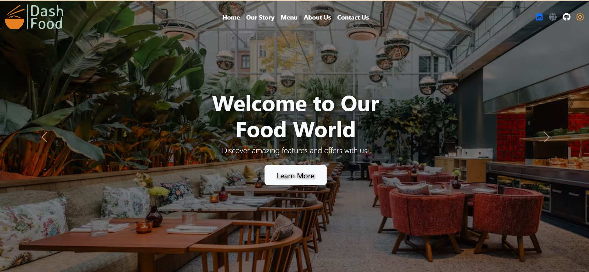
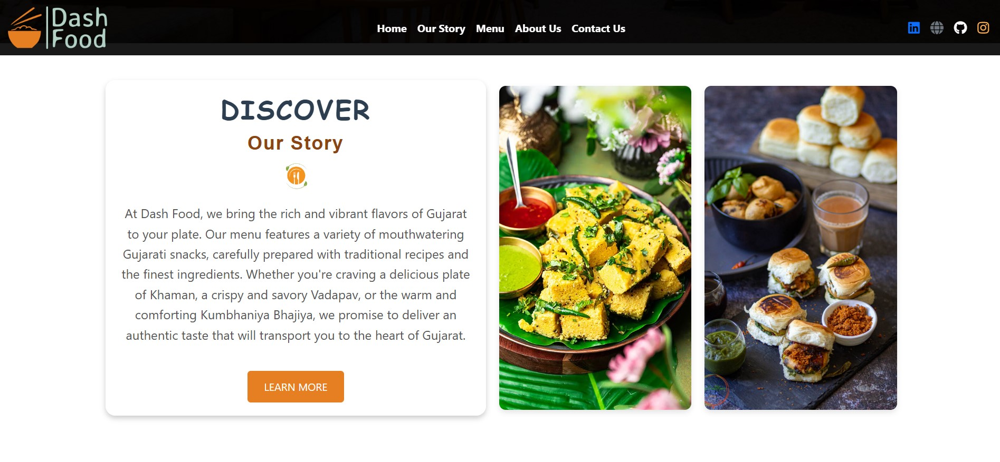
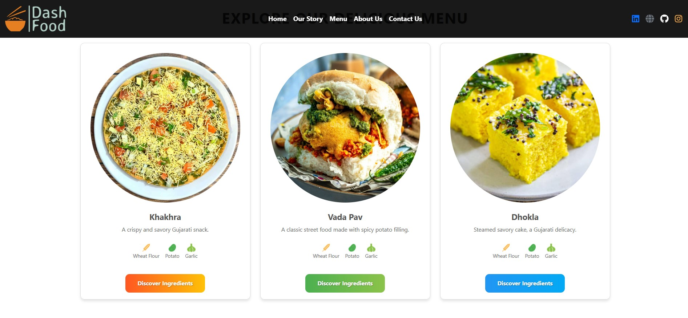
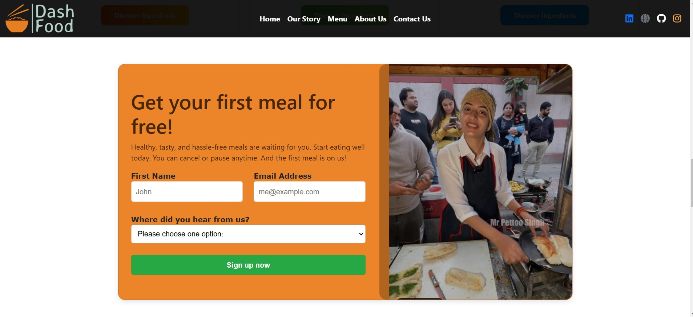
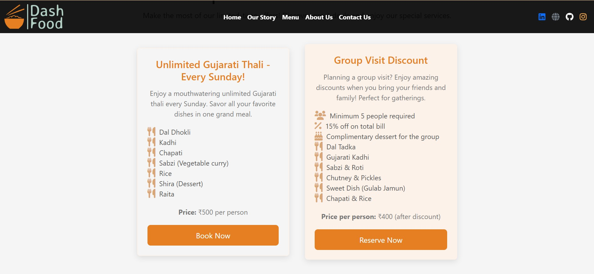
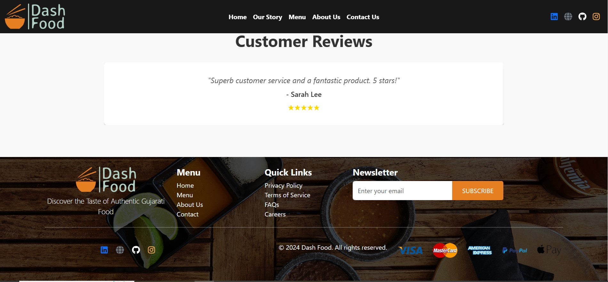
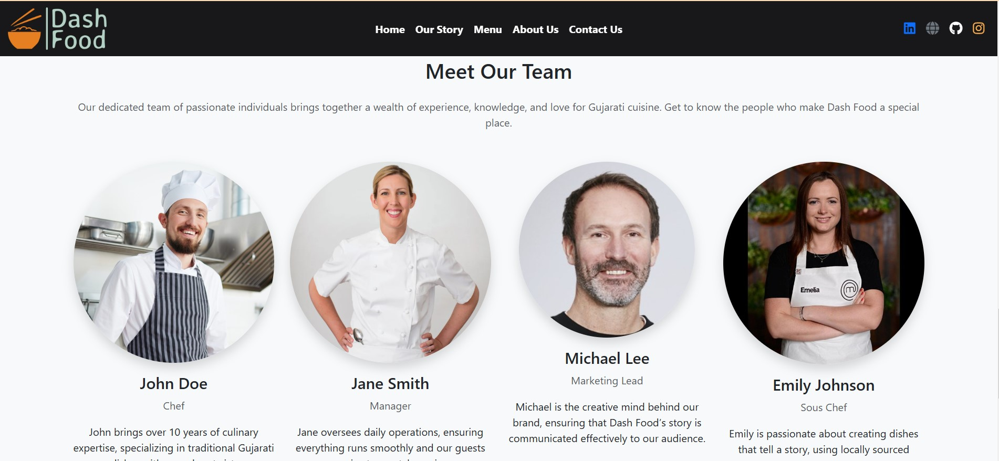
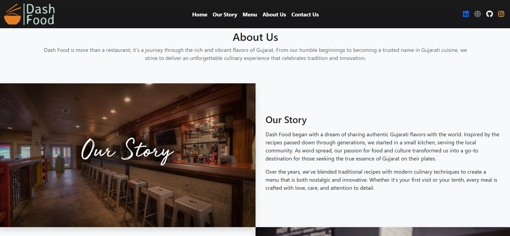

# DashFood

DashFood is a one-page website designed to showcase restaurant details, special offers, and delicious Gujarati food. This project provides an engaging and visually appealing experience for users looking for authentic Gujarati cuisine.

## Live Demo
[DashFood Live Project](https://raw.githack.com/Jenilpaladiya/DashFood/refs/heads/main/index.html)

## Features
- One-page responsive design
- Highlights restaurant details and special offers
- Showcases a variety of Gujarati dishes
- User-friendly UI with smooth navigation

## Technologies Used
- HTML5
- CSS3
- JavaScript (ES6)
- Bootstrap

## Demo Images
Here are some preview images of the project:

  
&nbsp;  
  
&nbsp;  
  
&nbsp;  
  
&nbsp;  
  
&nbsp;  
  
&nbsp;  
  
&nbsp;  
  
&nbsp;  
  

## How to Run the Project
1. Clone this repository:
   ```sh
   git clone https://github.com/Jenilpaladiya/DashFood.git
   ```
2. Open the `index.html` file in your browser.

## Author
Developed by [Jenil Paladiya](https://github.com/Jenilpaladiya).

## License
This project is licensed under the MIT License.
